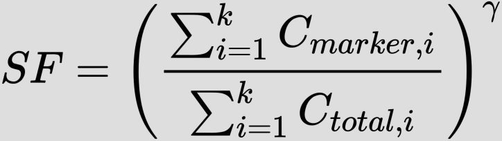

<!-- README.md is generated from README.Rmd. Please edit that file -->

```{r, include = FALSE}
knitr::opts_chunk$set(
  collapse = TRUE,
  comment = "#>",
  fig.path = "man/figures/README-",
  out.width = "100%"
)
```

# lcsc (linked charts for single cells)

<!-- badges: start -->
<!-- badges: end -->

## What is it about?

This package allows you to classify single cells based on nearest-neighbor smoothing, 
not relying on unsupervised learning methods. The documentation can be found [here](https://anders-biostat.github.io/lcsc/index.html).

Most often annotation of single cell data is done by clustering via graph-based methods followed by differential gene expression analysis between the clusters to find certain marker genes.

In this package we propose to directly start with the marker gene and calculate a smoothed fraction for the marker gene and to select cells based on whether they are above or below a chosen threshold. This smoothed fraction is calculated over the `k` nearest neighbors by dividing the sum of the marker gene counts for the nearest neighbors by their sum of total counts ("library size"). This fraction is subsequently raised to the power of $\gamma$ as some sort of gamma-correction (or Box-Cox correction). The threshold can then be simply chosen by looking at the distribution of this smoothed expression fraction. A screenshot is provided below.

```{r, echo=FALSE, out.width="40%", fig.align='center'}

```

## Installation

You can install the development version from [GitHub](https://github.com/) with:

``` r
# install.packages("devtools")
devtools::install_github("anders-biostat/lc-sc")
```

## Example

As in the [Guided Clustering Tutorial by Seurat](https://satijalab.org/seurat/articles/pbmc3k_tutorial.html), we will be using the PBMCdataset from 10X containing 2,700 single cells that were sequenced on the Illumina NextSeq 500. The raw data are made availbe by 10X [here](https://cf.10xgenomics.com/samples/cell/pbmc3k/pbmc3k_filtered_gene_bc_matrices.tar.gz).

We start of with the standard workflow consisting of quality control, normalization, and
linear/non-linear dimensional reduction using `Seurat`.

```{r setup, message=FALSE, warning=FALSE}
library(dplyr)
library(Seurat)

pbmc.data <- Read10X(data.dir = "inst/extdata/filtered_gene_bc_matrices/hg19/")
pbmc <- CreateSeuratObject(counts = pbmc.data, project = "pbmc3k", min.cells = 3, min.features = 200)
pbmc[["percent.mt"]] <- PercentageFeatureSet(pbmc, pattern = "^MT-")
pbmc <- NormalizeData(pbmc)
pbmc <- FindVariableFeatures(pbmc, selection.method = "vst", nfeatures = 2000)
pbmc <- ScaleData(pbmc, features = rownames(pbmc))
pbmc <- RunPCA(pbmc, features = VariableFeatures(object = pbmc))
pbmc <- FindNeighbors(pbmc, dims = 1:30)
pbmc <- RunUMAP(pbmc, dims = 1:30)
pbmc
```

To run the linked-charts for single cells, we need to extract the following data for the `Seurat` object.

1. Sparse count matrix (rows = genes, cols = cells)

```{r}
counts <- GetAssayData(pbmc, "counts")
dim(counts)
```

2. PC coordinates

```{r}
pc_space <- Embeddings(pbmc, "pca")
dim(pc_space)
```


3. Non-linear dimensional reduction embedding (2D)

```{r}
embedding <- Embeddings(pbmc, "umap")
dim(embedding)
```


4. Cell meta data

```{r}
meta_data <- pbmc[[]]
head(meta_data)
```

Based on these meta we will generate the `cells` that only contains the needed information and will be used to subset the counts according to which sample is selected.

```{r}
s = "orig.ident"  # name of the sample column
cells = tibble::tibble(
  id = rownames(meta_data),
  sample = meta_data[[s]]
)
head(cells)
```

Additionally we need to generate the neighborhood graph per sample containing the `k` nearest neighbors for each cell. For the computation the `lcsc` package provides the `run_nn` function, which also takes the number of pc_dimensions (`dim`) to be considered as input.

Start the `linked charts` application after generating a nearest neighborhood graph per sample.

```{r}
library(lcsc)

k = 50
nn <- run_nn(cells, pc_space, k=k, dim=30)
str(nn)
```

Now we can finally starts the `linked charts` application. `k` refers to the number of
nearest neighbors which are used for smoothing. See the equation above.

```{r eval = F}
lc_vis(cells=cells,
       counts=counts,
       pc_space=pc_space,
       embedding=embedding,
       nn=nn,
       k=50 # Smoothing the expression over 50 nearest neighbors
       )
```


The application would look like this after selecting macrophages using the smoothed expression of CD68.


```{r}
sessionInfo()
```

