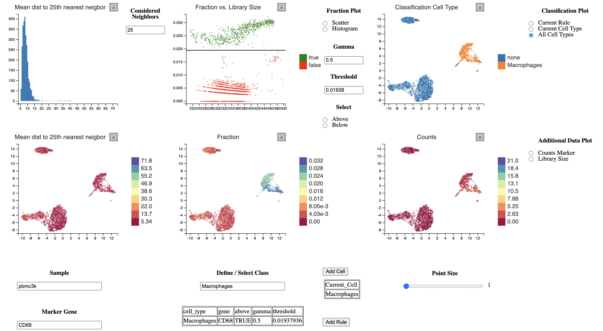

<!-- README.md is generated from README.Rmd. Please edit that file -->

# lcsc (linked charts for single cells)

<!-- badges: start -->

<!-- badges: end -->

## What is it about?

This package allows you to classify single cells based on
nearest-neighbor smoothing, not relying on unsupervised learning
methods. The documentation can be found
[here](https://anders-biostat.github.io/lcsc/index.html).

Most often annotation of single cell data is done by clustering via
graph-based methods followed by differential gene expression analysis
between the clusters to find certain marker genes.

In this package we propose to directly start with the marker gene and
calculate a smoothed fraction for the marker gene and to select cells
based on whether they are above or below a chosen threshold. This
smoothed fraction is calculated over the `k` nearest neighbors by
dividing the sum of the marker gene counts for the nearest neighbors by
their sum of total counts (“library size”). This fraction is
subsequently raised to the power of \(\gamma\) as some sort of
gamma-correction (or Box-Cox correction). The threshold can then be
simply chosen by looking at the distribution of this smoothed expression
fraction. A screenshot is provided
below.


## Installation

You can install the development version from
[GitHub](https://github.com/) with:

``` r
# install.packages("devtools")
devtools::install_github("anders-biostat/lc-sc")
```

## Example

As in the [Guided Clustering Tutorial by
Seurat](https://satijalab.org/seurat/articles/pbmc3k_tutorial.html), we
will be using the PBMCdataset from 10X containing 2,700 single cells
that were sequenced on the Illumina NextSeq 500. The raw data are made
availbe by 10X
[here](https://cf.10xgenomics.com/samples/cell/pbmc3k/pbmc3k_filtered_gene_bc_matrices.tar.gz).

We start of with the standard workflow consisting of quality control,
normalization, and linear/non-linear dimensional reduction using
`Seurat`.

``` r
library(dplyr)
library(Seurat)

pbmc.data <- Read10X(data.dir = "inst/extdata/filtered_gene_bc_matrices/hg19/")
pbmc <- CreateSeuratObject(counts = pbmc.data, project = "pbmc3k", min.cells = 3, min.features = 200)
pbmc[["percent.mt"]] <- PercentageFeatureSet(pbmc, pattern = "^MT-")
pbmc <- NormalizeData(pbmc)
pbmc <- FindVariableFeatures(pbmc, selection.method = "vst", nfeatures = 2000)
pbmc <- ScaleData(pbmc, features = rownames(pbmc))
pbmc <- RunPCA(pbmc, features = VariableFeatures(object = pbmc))
pbmc <- FindNeighbors(pbmc, dims = 1:30)
pbmc <- RunUMAP(pbmc, dims = 1:30)
pbmc
#> An object of class Seurat 
#> 13714 features across 2700 samples within 1 assay 
#> Active assay: RNA (13714 features, 2000 variable features)
#>  2 dimensional reductions calculated: pca, umap
```

To run the linked-charts for single cells, we need to extract the
following data for the `Seurat` object.

1.  Sparse count matrix (rows = genes, cols = cells)

<!-- end list -->

``` r
counts <- GetAssayData(pbmc, "counts")
dim(counts)
#> [1] 13714  2700
```

2.  PC coordinates

<!-- end list -->

``` r
pc_space <- Embeddings(pbmc, "pca")
dim(pc_space)
#> [1] 2700   50
```

3.  Non-linear dimensional reduction embedding (2D)

<!-- end list -->

``` r
embedding <- Embeddings(pbmc, "umap")
dim(embedding)
#> [1] 2700    2
```

4.  Cell meta data

<!-- end list -->

``` r
meta_data <- pbmc[[]]
head(meta_data)
#>                  orig.ident nCount_RNA nFeature_RNA percent.mt
#> AAACATACAACCAC-1     pbmc3k       2419          779  3.0177759
#> AAACATTGAGCTAC-1     pbmc3k       4903         1352  3.7935958
#> AAACATTGATCAGC-1     pbmc3k       3147         1129  0.8897363
#> AAACCGTGCTTCCG-1     pbmc3k       2639          960  1.7430845
#> AAACCGTGTATGCG-1     pbmc3k        980          521  1.2244898
#> AAACGCACTGGTAC-1     pbmc3k       2163          781  1.6643551
```

Based on these meta we will generate the `cells` that only contains the
needed information and will be used to subset the counts according to
which sample is selected.

``` r
s = "orig.ident"  # name of the sample column
cells = tibble::tibble(
  id = rownames(meta_data),
  sample = meta_data[[s]]
)
head(cells)
#> Registered S3 method overwritten by 'cli':
#>   method     from         
#>   print.boxx spatstat.geom
#> # A tibble: 6 × 2
#>   id               sample
#>   <chr>            <fct> 
#> 1 AAACATACAACCAC-1 pbmc3k
#> 2 AAACATTGAGCTAC-1 pbmc3k
#> 3 AAACATTGATCAGC-1 pbmc3k
#> 4 AAACCGTGCTTCCG-1 pbmc3k
#> 5 AAACCGTGTATGCG-1 pbmc3k
#> 6 AAACGCACTGGTAC-1 pbmc3k
```

Additionally we need to generate the neighborhood graph per sample
containing the `k` nearest neighbors for each cell. For the computation
the `lcsc` package provides the `run_nn` function, which also takes the
number of pc\_dimensions (`dim`) to be considered as input.

Start the `linked charts` application after generating a nearest
neighborhood graph per sample.

``` r
library(lcsc)

k = 50
nn <- run_nn(cells, pc_space, k=k, dim=30)
str(nn)
#> List of 2
#>  $ idx  : num [1:2700, 1:50] 1 2 3 4 5 6 7 8 9 10 ...
#>  $ dists: num [1:2700, 1:50] 0 0 0 0 0 0 0 0 0 0 ...
```

Now we can finally starts the `linked charts` application. `k` refers to
the number of nearest neighbors which are used for smoothing. See the
equation above.

``` r
lc_vis(cells=cells,
       counts=counts,
       pc_space=pc_space,
       embedding=embedding,
       nn=nn,
       k=50 # Smoothing the expression over 50 nearest neighbors
       )
```

The application would look like this after selecting macrophages using
the smoothed expression of CD68.



``` r
sessionInfo()
#> R version 4.0.3 (2020-10-10)
#> Platform: x86_64-pc-linux-gnu (64-bit)
#> Running under: Ubuntu 18.04.5 LTS
#> 
#> Matrix products: default
#> BLAS:   /usr/lib/x86_64-linux-gnu/blas/libblas.so.3.7.1
#> LAPACK: /usr/lib/x86_64-linux-gnu/lapack/liblapack.so.3.7.1
#> 
#> locale:
#>  [1] LC_CTYPE=en_US.UTF-8       LC_NUMERIC=C              
#>  [3] LC_TIME=en_US.UTF-8        LC_COLLATE=en_US.UTF-8    
#>  [5] LC_MONETARY=en_US.UTF-8    LC_MESSAGES=en_US.UTF-8   
#>  [7] LC_PAPER=en_US.UTF-8       LC_NAME=C                 
#>  [9] LC_ADDRESS=C               LC_TELEPHONE=C            
#> [11] LC_MEASUREMENT=en_US.UTF-8 LC_IDENTIFICATION=C       
#> 
#> attached base packages:
#> [1] stats     graphics  grDevices utils     datasets  methods   base     
#> 
#> other attached packages:
#> [1] lcsc_0.0.0.9000    SeuratObject_4.0.2 Seurat_4.0.4       dplyr_1.0.7       
#> 
#> loaded via a namespace (and not attached):
#>   [1] nlme_3.1-149          spatstat.sparse_2.0-0 matrixStats_0.60.1   
#>   [4] RcppAnnoy_0.0.19      RColorBrewer_1.1-2    httr_1.4.2           
#>   [7] sctransform_0.3.2     tools_4.0.3           utf8_1.2.2           
#>  [10] R6_2.5.1              irlba_2.3.3           rpart_4.1-15         
#>  [13] KernSmooth_2.23-17    uwot_0.1.10           mgcv_1.8-33          
#>  [16] DBI_1.1.1             lazyeval_0.2.2        colorspace_2.0-2     
#>  [19] tidyselect_1.1.1      gridExtra_2.3         compiler_4.0.3       
#>  [22] cli_3.0.1             plotly_4.9.4.1        scales_1.1.1         
#>  [25] spatstat.data_2.1-0   lmtest_0.9-38         ggridges_0.5.3       
#>  [28] pbapply_1.4-3         goftest_1.2-2         stringr_1.4.0        
#>  [31] digest_0.6.27         spatstat.utils_2.2-0  rmarkdown_2.10       
#>  [34] pkgconfig_2.0.3       htmltools_0.5.1.1     parallelly_1.27.0    
#>  [37] fastmap_1.1.0         highr_0.9             htmlwidgets_1.5.3    
#>  [40] rlang_0.4.11          rstudioapi_0.13       shiny_1.6.0          
#>  [43] generics_0.1.0        zoo_1.8-9             jsonlite_1.7.2       
#>  [46] ica_1.0-2             magrittr_2.0.1        patchwork_1.1.1      
#>  [49] Matrix_1.3-4          Rcpp_1.0.7            munsell_0.5.0        
#>  [52] fansi_0.5.0           abind_1.4-5           reticulate_1.20      
#>  [55] lifecycle_1.0.0       stringi_1.7.3         yaml_2.2.1           
#>  [58] MASS_7.3-53           Rtsne_0.15            plyr_1.8.6           
#>  [61] grid_4.0.3            parallel_4.0.3        listenv_0.8.0        
#>  [64] promises_1.2.0.1      ggrepel_0.9.1         crayon_1.4.1         
#>  [67] deldir_0.2-10         miniUI_0.1.1.1        lattice_0.20-41      
#>  [70] cowplot_1.1.1         splines_4.0.3         tensor_1.5           
#>  [73] knitr_1.33            pillar_1.6.2          igraph_1.2.6         
#>  [76] spatstat.geom_2.2-2   future.apply_1.8.1    reshape2_1.4.4       
#>  [79] codetools_0.2-16      leiden_0.3.9          glue_1.4.2           
#>  [82] evaluate_0.14         data.table_1.14.0     png_0.1-7            
#>  [85] vctrs_0.3.8           httpuv_1.6.2          polyclip_1.10-0      
#>  [88] spatstat.core_2.3-0   gtable_0.3.0          RANN_2.6.1           
#>  [91] purrr_0.3.4           tidyr_1.1.3           scattermore_0.7      
#>  [94] future_1.22.1         assertthat_0.2.1      ggplot2_3.3.5        
#>  [97] xfun_0.25             mime_0.11             xtable_1.8-4         
#> [100] RSpectra_0.16-0       later_1.3.0           survival_3.2-7       
#> [103] viridisLite_0.4.0     tibble_3.1.4          cluster_2.1.0        
#> [106] globals_0.14.0        fitdistrplus_1.1-5    ellipsis_0.3.2       
#> [109] ROCR_1.0-11
```
