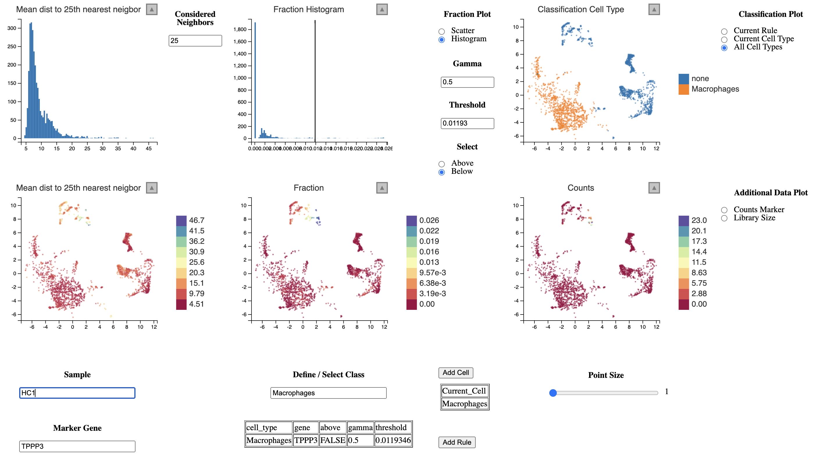

```{r, include = FALSE}
knitr::opts_chunk$set(
  collapse = TRUE,
  comment = "#>"
)
```


# How to use lcsc for real analyses

For demonstration purposes we will be using the dataset created in the study
"Single-cell landscape of bronchoalveolar immune cells in COVID-19 patients" 
by Liao M. et al. 

We authors directly provided the processed data as `Seurat` object which can be downloaded [here](http://cells.ucsc.edu/covid19-balf/nCoV.rds). 

```{r eval=FALSE}
# Download
download.file("http://cells.ucsc.edu/covid19-balf/nCoV.rds", "nCoV.rds")
# Or directly load into R (not recommended, size is about 3G GB)
balf <- readRDS(url("http://cells.ucsc.edu/covid19-balf/nCoV.rds","rb"))
```

```{r}
library(Seurat)
balf <- readRDS("../data/nCoV.rds") # how they do it in the Seurat vignette
balf
```

To run lcsc we need to extract the following data. Since 

```{r}
# From Seurat Object
counts <- GetAssayData(balf, "counts")
meta_data <- balf[[]]
pc_space <- Embeddings(balf, "pca")
embedding <- Embeddings(balf, "umap")

sample_column <- "sample_new"   # column for sample name
disease_column <- "disease"   # column for disease state
  
cells = tibble::tibble(
  id = rownames(meta_data),
  sample = meta_data[[sample_column]],
  disease = meta_data[[disease_column]]
)
head(cells)
table(cells$disease)
```

```{r}
table(cells$sample)
```

And we actually notice that the authors mispelled some of the samples. Let's replace the "O" with an "S".

```{r}
cells$sample <- stringr::str_replace(cells$sample, "O(?=[1-3])", "M")
cells$sample <- stringr::str_replace(cells$sample, "S1", "S0")
cells$sample <- stringr::str_replace(cells$sample, "^C(?=[1-5])", "S")
table(cells$sample)
```

Furthermore we can add a condition column to the cells tibble.

```{r}
cells$condition <- stringr::str_remove(cells$sample, "\\d")
table(cells$condition)
```

In the next step we load `lcsc` and compute the nearest neighbor graph per sample.

```{r}
library(lcsc)

nn <- run_nn(cells, 
             pc_space, 
             k=50,     # Compute 50 nearest neigbors per cell
             dim=30)   # Using 30 PCs to compute NN
str(nn)
```

Now we can load the application and start to annotate cells per sample. This requires some manual effort,
but we do not rely on integration methods for multiple samples or unsupervised learning methods.

```{r eval=FALSE}
# Add option to load in annotation/rule file
lc_vis(cells=cells,
       counts=counts,
       pc_space=pc_space,
       embedding=embedding,
       nn=nn,
       k=30 # Smoothing the expression over 50 nearest neighbors
       )
```

The classification of macrophages in each sample could look like this. We define macrophages
as cells which express CD68 and do not express CD3E (T-cells) or TPPP3 (Epithelial cells).

{width=1000px}

To go back and refine the annotation one should save the annotation and the rule list.

```{r eval=FALSE}
save(annotations, rules, file = "macrophage_annotation.RData")
```

If one wishes to refine the annotation at some point, one can simply reload the application as done
above and overwrite the `annotations` and `rules` objects by loading the `.RData` file.

```{r}
load("macrophage_annotation.RData")
```

Once we have annotated our cell type of interest we could perform for example differential gene
expression analysis between the cell type under different conditions (e. g. mild vs. severe 
Covid-19 infection).

To ease such analysis steps the package ships with a function to easily create pseudobulks
for each cell type that was annotated stratified by some column of the `cells` tibble.

```{r}
# We want to compare macrophages in mild vs. severe Covid-19
mild_samples <- unique(cells$sample)[grepl("M", unique(cells$sample))]
head(mild_samples)
severe_samples <- unique(cells$sample)[grepl("S", unique(cells$sample))]
head(severe_samples)

cell_type = "Macrophages"

mild_matrix <- NULL
for (sample in mild_samples) {
  cell_type_barcodes <- annotations[[sample]][[cell_type]]$barcode
  mild_matrix <- cbind(mild_matrix, Matrix::rowSums(counts[, cell_type_barcodes]))
}
colnames(mild_matrix) <- mild_samples
head(mild_matrix)

severe_matrix <- NULL
for (sample in severe_samples) {
  cell_type_barcodes <- annotations[[sample]][[cell_type]]$barcode
  severe_matrix <- cbind(severe_matrix, Matrix::rowSums(counts[, cell_type_barcodes]))
}
colnames(severe_matrix) <- severe_samples
head(severe_matrix)

coldata <- data.frame(sample=c(mild_samples, severe_samples))
coldata$condition <- ifelse(startsWith(coldata$sample, "M"), "mild", "severe")
coldata

suppressPackageStartupMessages(library(DESeq2))
dds <- DESeqDataSetFromMatrix(countData = cbind(mild_matrix, severe_matrix),
                                colData = coldata,
                                design = ~ condition)

dds <- DESeq(dds)
res <- results(dds)

suppressPackageStartupMessages(library(dplyr))
res %>%
  as.data.frame %>% 
  filter(padj < 0.1) %>%
  arrange(desc(log2FoldChange)) %>%
  select(-pvalue) %>%
  slice_head(n=10)
```


