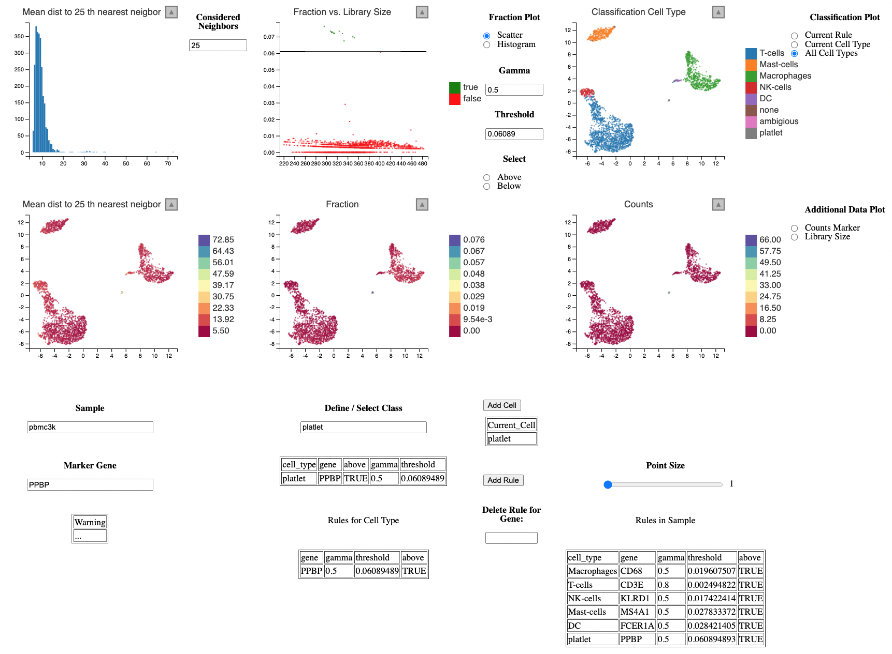

# How to get started with lcsc

As in the Guided Clustering Tutorial by Seurat, we will be using the PBMC dataset from 10X containing
2,700 single cells that were sequenced on the Illumina NextSeq 500. The raw data are made availbe by 10X [here](https://cf.10xgenomics.com/samples/cell/pbmc3k/pbmc3k_filtered_gene_bc_matrices.tar.gz).

```{r eval=FALSE}
library(dplyr)
library(Seurat)
# Load the PBMC dataset
pbmc.data <- Read10X(data.dir = "../data/filtered_gene_bc_matrices/hg19/")
# Initialize the Seurat object with the raw (non-normalized data).
pbmc <- CreateSeuratObject(counts = pbmc.data, project = "pbmc3k", min.cells = 3, min.features = 200)
pbmc
```

Run classic single cell workflow using Seurat.

```{r eval=FALSE}
pbmc[["percent.mt"]] <- PercentageFeatureSet(pbmc, pattern = "^MT-")
pbmc <- subset(pbmc, subset = nFeature_RNA > 200 & nFeature_RNA < 2500 & percent.mt < 5)
pbmc <- NormalizeData(pbmc)
pbmc <- FindVariableFeatures(pbmc, selection.method = "vst", nfeatures = 2000)
all.genes <- rownames(pbmc)
pbmc <- ScaleData(pbmc, features = all.genes)
pbmc <- RunPCA(pbmc, features = VariableFeatures(object = pbmc))
pbmc <- FindNeighbors(pbmc, dims = 1:10)
pbmc <- FindClusters(pbmc, resolution = 0.5)
pbmc <- RunUMAP(pbmc, dims = 1:10)
```

To run lcsc we need the following data:

```{r eval=FALSE}
# From Seurat Object
counts <- GetAssayData(pbmc, "counts")
meta_data <- pbmc[[]]
pc_space <- Embeddings(pbmc, "pca")
embedding <- Embeddings(pbmc, "umap")

# How is the sample column named?
s = "orig.ident"
cells = tibble::tibble(
  id = rownames(meta_data),
  sample = meta_data[[s]]
)
head(cells)
```

Furthermore, we need to compute the nearest neighbors per sample, for example using a helper function from the package.

```{r eval=FALSE}
devtools::load_all("/home/psls/lcsc/")

k = 50 # Compute 50 nearest neigbors per cell
nn <- run_nn(cells, pc_space, k=k, dim=30)  # Using 30 principal components to compute NN
```

Now we can start the linked charts application to classify cells.

```{r eval=FALSE}

lc_vis(cells=cells,
       counts=counts,
       pc_space=pc_space,
       embedding=embedding,
       nn=nn,
       k=50 # Smoothing the expression over 50 nearest neighbors
       )
```

The broad classification could look like this:

 

